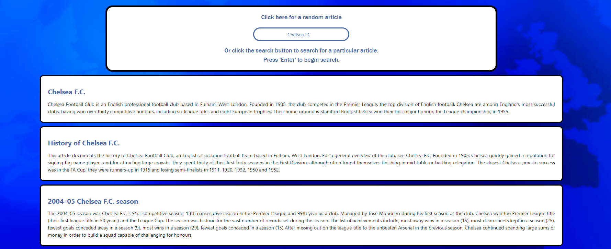

# Wikipedia Search

## Table of Contents
  - [General Information](#general-information)
  - [Installation](#installation)
  - [Usage](#usage)
  - [Technologies](#technologies)
## General Information

The Wikipedia Search app allows you to quickly search through Wikipedia articles, and view a quick overview at a glance to get the context of the article shown. Each article can be clicked to view the article externally on Wikipedia's own site.

This application was created a few years ago to solidify my knowledge with using jQuery and fetching with APIs, however this has been refactored to use React and pure TypeScript to keep up with the latest technology trends.

## Installation

To install the application you will need to clone the repository by running `git clone https://github.com/jamesgower/wikipedia-api.git`, or alternatively you can download the contents of the repository in a zip folder. Once the repository has been downloaded you can run the app locally by navigating to the root directory of the repository and running `npm install` followed by `npm run start` from CLI. The app can then be found at http://localhost:3000.

## Usage

To application can be accessed through [this](FIXME) link (FIXME). You can alternatively view the application by cloning or downloading it with the method above.

## Technologies

- React 17
- Reactstrap
- TypeScript
- SCSS
- Wikipedia's API
- Create React App (TypeScript Template)
